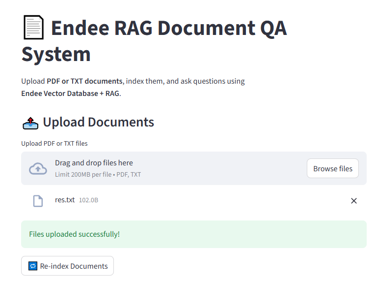
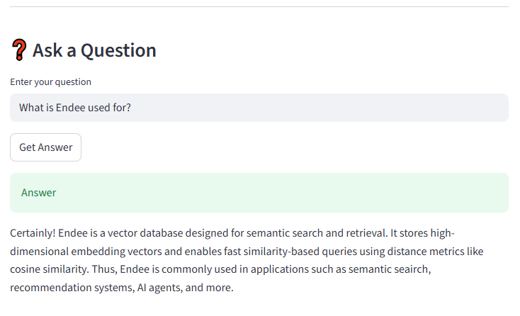

# Endee RAG Document Search & Question Answering System

## 📌 Project Overview

This project implements a **Retrieval Augmented Generation (RAG) based Document Question Answering System** using **Endee as the core vector database**.

The system allows users to:
- Upload TXT or PDF documents
- Convert documents into embeddings
- Store embeddings in Endee
- Perform vector similarity search
- Generate context-grounded answers using a local LLM

The project demonstrates a practical AI application where **vector search is the central component**, fulfilling the Endee Labs evaluation criteria.

---

# 🎯 Core Objective

The primary objective of this project is to demonstrate how **Endee Vector Database** can be used in a real-world AI/ML pipeline:

1. Store high-dimensional embeddings
2. Perform similarity-based retrieval
3. Enable Retrieval Augmented Generation (RAG)
4. Support semantic document search

---

# 🧠 How Endee Vector Database Is Used

Endee plays a central role in this system.

## 1️⃣ Index Creation in Endee

An index is created in Endee using its REST API.  
The index defines:

- Vector dimension (384 for MiniLM model)
- Similarity metric (cosine similarity)

This index acts as the vector storage container.

## 2️⃣ Storing Embeddings in Endee

After loading documents:

- Documents are converted into embeddings using `all-MiniLM-L6-v2`
- Each embedding is sent to Endee via:

POST /api/v1/index/{indexName}/vector/insert

Endee stores:
- Vector ID
- Embedding values

Metadata (like original text and filename) is stored locally since Endee does not persist metadata.

## 3️⃣ Similarity Search Using Endee

When a user asks a question:

- The question is converted into an embedding
- A search request is sent to Endee:

POST /api/v1/index/{indexName}/search

Endee performs:
- Cosine similarity computation
- Returns top-k most similar vectors

This is the core semantic retrieval mechanism.

## 4️⃣ RAG Integration

After Endee returns similar vector IDs:

- Local metadata is resolved
- Retrieved document content is combined
- A RAG prompt is constructed
- Local LLM (TinyLLaMA via Ollama) generates the final answer

Thus, **Endee is responsible for semantic retrieval**, while the LLM handles answer generation.

---

# 🏗️ System Architecture

```
User Question
      |
      v
Generate Query Embedding
      |
      v
Search in Endee (Vector Similarity)
      |
      v
Retrieve Top-K Matching Documents
      |
      v
Build RAG Prompt with Retrieved Context
      |
      v
Local LLM Generates Answer
```

---

# 🧰 Tech Stack

- Vector Database: Endee
- Embedding Model: all-MiniLM-L6-v2
- LLM: TinyLLaMA (via Ollama – local inference)
- Backend: Python 3.10
- Frontend: Streamlit
- Supported Documents: TXT, PDF

---

# 📂 Project Structure

```
endee-rag-doc-search/
|
|-- data/
|   |-- documents/
|
|-- src/
|   |-- ingest.py
|   |-- embedder.py
|   |-- vector_store.py
|   |-- retriever.py
|   |-- index_documents.py
|   |-- rag_qa.py
|   |-- app.py
|
|-- vector_metadata.json
|-- requirements.txt
|-- README.md
```

---

# ⚙️ Setup Instructions

## 1. Prerequisites

- Python 3.10
- Docker Desktop
- Ollama

---

## 2. Clone Repository

```
git clone <your-github-repository-url>
cd endee-rag-doc-search
```

---

## 3. Create Virtual Environment

```
python -m venv venv
venv\Scripts\activate
```

---

## 4. Install Dependencies

```
pip install -r requirements.txt
```

---

## 5. Run Endee (Vector Database)

```
docker run -p 8080:8080 -v endee-data:/data --name endee-server endeeio/endee-server:latest
```

Verify:

```
http://localhost:8080
```

---

## 6. Install Ollama and Model

Download Ollama:

```
https://ollama.com/download
```

Pull model:

```
ollama pull tinyllama
```

---

# 🚀 Running the Application

## Index Documents

```
python src/index_documents.py
```

This:
- Loads documents
- Generates embeddings
- Stores vectors in Endee
- Saves metadata locally

## Run Frontend

```
streamlit run src/app.py
```

Open:

```
http://localhost:8501
```

---

# 🖥️ Application Features

- Upload TXT or PDF documents
- Re-index documents from frontend
- Semantic similarity search via Endee
- Context-grounded RAG answers
- Upload optional (previously indexed documents remain usable)

---

## 📸 Sample Output Screenshots

### RAG Answer Output – Example 1


### RAG Answer Output – Example 2



# 🧠 Design Decisions

- Endee used strictly for vector similarity search
- Local metadata management for document mapping
- Lightweight local LLM for reproducibility
- Clear separation between retrieval and generation

---

# 📈 Future Enhancements

- Document chunking
- DOCX support
- Improved UI
- Chat memory
- Multi-user support

---

# ✅ Endee Labs Evaluation Checklist

✔ Endee used as primary vector database  
✔ Demonstrates RAG use case  
✔ GitHub hosted project  
✔ Clean documentation  
✔ Fully functional demo  

---

# 👨‍💻 Author

Endee Labs Assignment Submission  
Project-Based Evaluation  

---

# 📜 License

Academic and educational use only.
